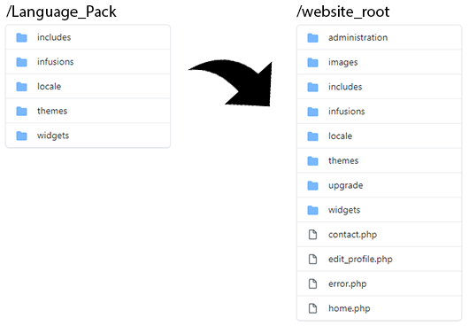

PHPFusion Locales
=================

Download: https://www.php-fusion.co.uk/translations/

### Crowdin
Invitation Link: https://translate.php-fusion.co.uk/project/php-fusion-locales/invite (Members with no contributions will be removed)

Locales for v9: https://github.com/php-fusion/locales/tree/version-9

Locales for v8: https://github.com/php-fusion/locales/tree/version-8

Locales for v7: https://github.com/php-fusion/locales/tree/version-7

 - If you want to translate the core, please use Crowdin.
 - Third-party scripts (includes folder) or readme-\*.html you need to translate manually and create a Pull Request.

## How to install another language
It's easy, move all folders from the language pack to website root. After moving files go to Admin Dashboard and open Language Settings then enable your language.

